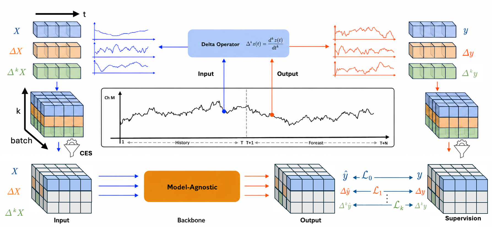
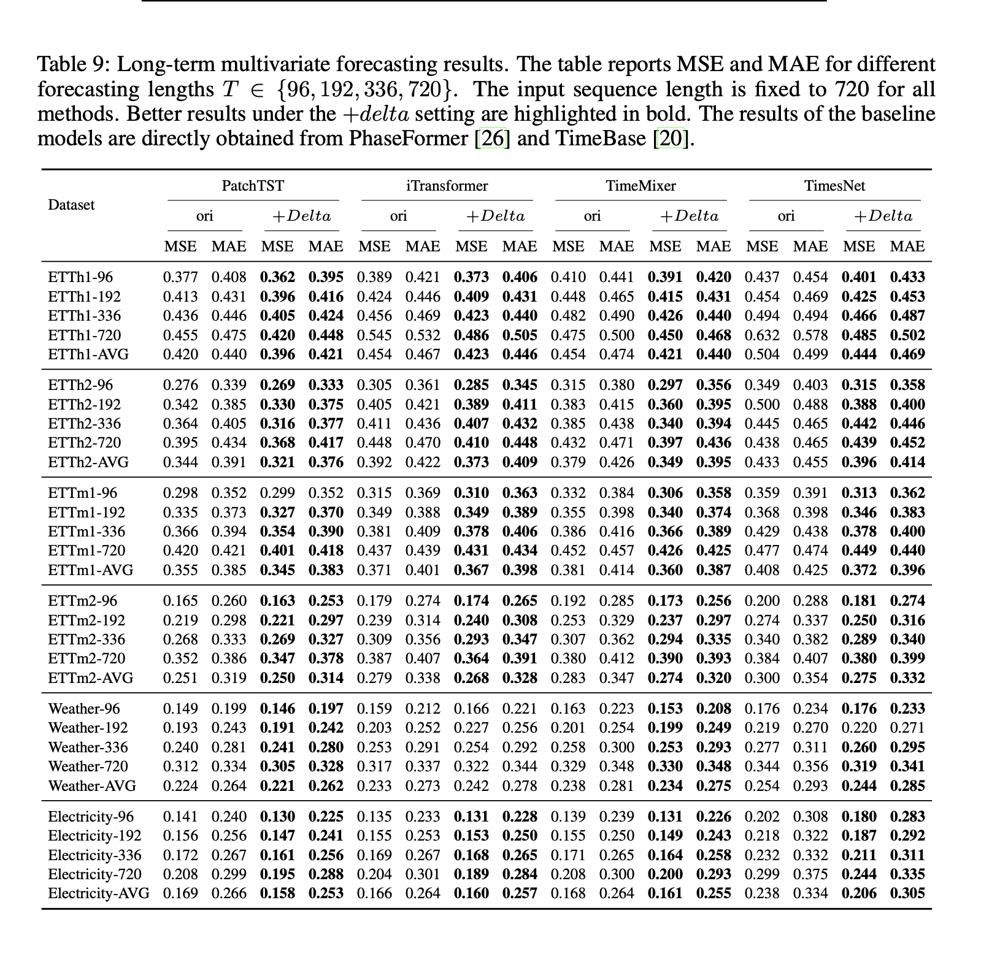
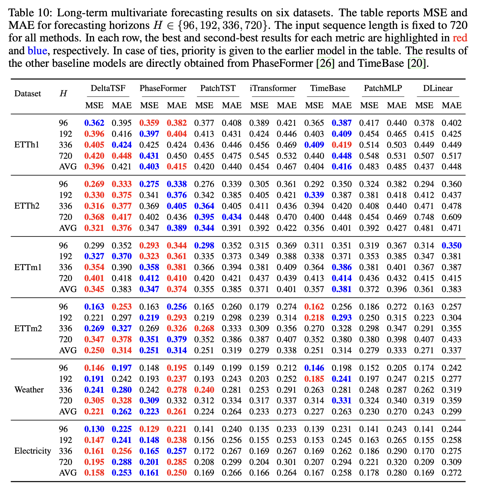

# DeltaTSF

**Learning Temporal Dynamics with Derivative Representations for Time Series Forecasting**

## Abstract

Time series forecasting aims to predict the future evolution of complex systems by learning their underlying dynamics from past observations. Despite recent advances in deep learning, Transformers in particular still struggle to capture the temporal evolution of system dynamics. Existing approaches have been largely driven by architectural innovation, with comparatively little attention paid to training strategies that explicitly exploit the temporal structure governing system dynamics. In this work, we introduce DeltaTSF, a dynamics-aware forecasting framework based on discrete derivative representations of time series. Specifically, DeltaTSF jointly learns the series and their discrete temporal derivatives across both input and forecast horizons within a unified, model-agnostic framework. By coupling these representations over time, the model is encouraged to maintain temporal consistency, a property we show to induce a form of discrete Taylor consistency during training. This formulation enables the model to better reflect the underlying system dynamics, resulting in more stable and physically coherent forecasts. Notably, DeltaTSF does not require explicit derivative computation and introduces no additional computational overhead at inference time. Extensive experiments across diverse benchmarks and backbone architectures demonstrate that DeltaTSF consistently improves forecasting performance and yields more dynamically coherent predictions than strong SOTA methods. These results highlight the effectiveness of enforcing dynamic coherence through derivative representations as a model-agnostic paradigm that operates alongside and complements architectural design. Source code will be made publicly available upon acceptance.

## Overview



**Figure 1.** Overview of our DeltaTSF, a model-agnostic training paradigm for existing forecasting backbones without modifying their architectures. DeltaTSF jointly models series and their temporal derivatives within a shared architecture, coupling their predictions across time to enforce temporally structural alignment.

## Code Structure

This repository contains the PatchTST-based implementation of **DeltaTSF**, a
training framework for time-series forecasting that jointly models raw series
values and first-order temporal differences.

The PatchTST backbone is kept unchanged. The DeltaTSF additions are concentrated
in a small number of files:

- `utils/deltatsf.py`: DeltaTSF feature construction, losses, and CES helpers
- `data_provider/data_loader.py`: raw + first-order difference channels
- `exp/exp_rr.py`: main DeltaTSF + Compute-Equivalent Sampling path
- `exp/exp_main.py`: full raw + difference training path for the no-CES ablation
- `run_longExp.py`: DeltaTSF arguments such as `--w_diff1` and `--rand_replace`

## Main Entry Points

`exp/exp_rr.py` is the main DeltaTSF + CES experiment path. It is selected by
passing `--rand_replace 1` to `run_longExp.py`.

`exp/exp_main.py` keeps the full raw + difference channel training path and is
useful for the no-CES ablation.

## Reproduction

Prepare the datasets under the path used by the scripts, then run:

```bash
bash run_best.sh
```

The CES scripts in `scripts/PatchTST/rr/` correspond to the paper's DeltaTSF
structure and are used by `run_best.sh` and `scripts/PatchTST/run_all.sh`.

```text
scripts/PatchTST/rr/
```

For example:

```bash
bash scripts/PatchTST/rr/etth1.sh 5
```

The full raw + difference channel scripts without CES are kept for ablation in:

```text
scripts/PatchTST/main/
```

Both `run_best.sh` and `scripts/PatchTST/run_all.sh` use the shared GPU
launcher in `scripts/PatchTST/launcher.sh`. You can control scheduling with:

```bash
START_GPU=0 END_GPU=7 MAX_PARALLEL=8 bash run_best.sh
```

## Backbone Integrations

Additional DeltaTSF + CES integration files for iTransformer, TimeMixer, and
TimesNet are provided in:

```text
integrations/
```

These folders contain only the key files that should be copied into the
corresponding upstream backbone repositories. They are not full forks.

## Results

The original LaTeX result tables, Markdown renderings, and rendered table images
are stored under:

```text
output/
```

- `output/table9_long_term_results.png`
- `output/table10_baseline_comparison.png`
- `output/table9_mixup_vs_delta.tex`
- `output/table9_mixup_vs_delta.md`
- `output/table10_long_term_results.tex`
- `output/table10_long_term_results.md`

### Table 9. Long-term multivariate forecasting results



### Table 10. Long-term multivariate forecasting results on six datasets



## Notes

The repository intentionally excludes checkpoints, logs, generated results, and
large experiment artifacts. The core PatchTST architecture files are kept close
to the original backbone so the DeltaTSF modifications are easy to inspect.
